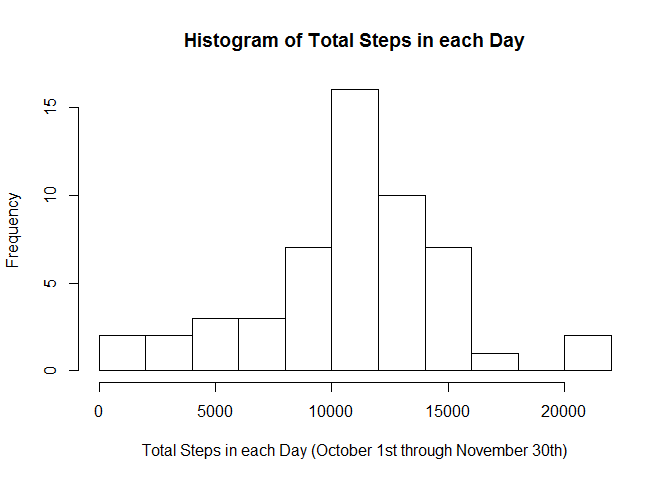
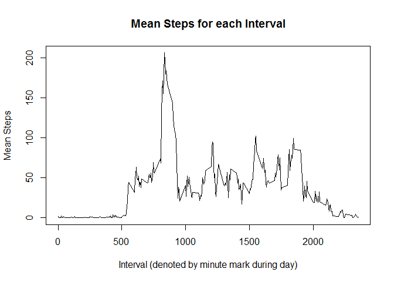
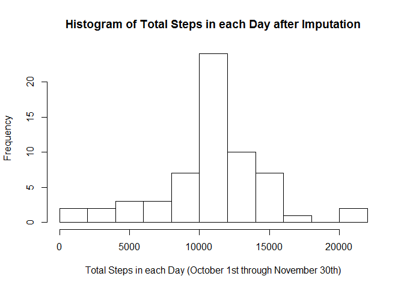
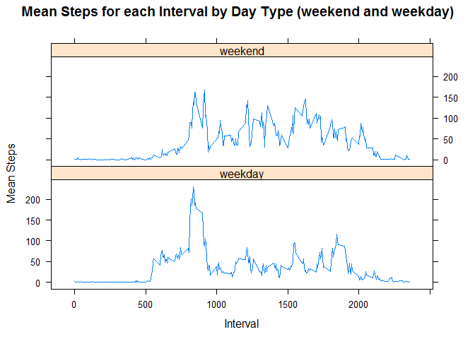

# Reproducible Research: Peer Assessment 1


## Loading and Preprocessing the Data

First things first, let's load the packages we are going to use, read in the data, 
and create a data frame without NA's, which we will be using for the first couple sections.


```r
library(dplyr)
library(lattice)

## import data and remove NA's 
df <- read.csv("activity.csv")
nonNAdf <- df[!is.na(df$steps),]
```


## What is the mean total number of steps taken per day?

First, we want to find the total steps in each day. This will allow us to plot 
the histogram showing which buckets of total steps that days fall into.


```r
## group data by date, and calculate the total steps during each date
totalSteps <- nonNAdf %>% group_by(date) %>% summarize(totalStepsPerDay = sum(steps))
print(totalSteps, n = nrow(totalSteps))
```

```
## Source: local data frame [53 x 2]
## 
##          date totalStepsPerDay
##        (fctr)            (int)
## 1  2012-10-02              126
## 2  2012-10-03            11352
## 3  2012-10-04            12116
## 4  2012-10-05            13294
## 5  2012-10-06            15420
## 6  2012-10-07            11015
## 7  2012-10-09            12811
## 8  2012-10-10             9900
## 9  2012-10-11            10304
## 10 2012-10-12            17382
## 11 2012-10-13            12426
## 12 2012-10-14            15098
## 13 2012-10-15            10139
## 14 2012-10-16            15084
## 15 2012-10-17            13452
## 16 2012-10-18            10056
## 17 2012-10-19            11829
## 18 2012-10-20            10395
## 19 2012-10-21             8821
## 20 2012-10-22            13460
## 21 2012-10-23             8918
## 22 2012-10-24             8355
## 23 2012-10-25             2492
## 24 2012-10-26             6778
## 25 2012-10-27            10119
## 26 2012-10-28            11458
## 27 2012-10-29             5018
## 28 2012-10-30             9819
## 29 2012-10-31            15414
## 30 2012-11-02            10600
## 31 2012-11-03            10571
## 32 2012-11-05            10439
## 33 2012-11-06             8334
## 34 2012-11-07            12883
## 35 2012-11-08             3219
## 36 2012-11-11            12608
## 37 2012-11-12            10765
## 38 2012-11-13             7336
## 39 2012-11-15               41
## 40 2012-11-16             5441
## 41 2012-11-17            14339
## 42 2012-11-18            15110
## 43 2012-11-19             8841
## 44 2012-11-20             4472
## 45 2012-11-21            12787
## 46 2012-11-22            20427
## 47 2012-11-23            21194
## 48 2012-11-24            14478
## 49 2012-11-25            11834
## 50 2012-11-26            11162
## 51 2012-11-27            13646
## 52 2012-11-28            10183
## 53 2012-11-29             7047
```

```r
## plot frequency of numbers of steps per day
hist(totalSteps$totalStepsPerDay, breaks = 10, 
     xlab = "Total Steps in each Day (October 1st through November 30th)",
     main = "Histogram of Total Steps in each Day")
```

 

Looking at the histogram, the 10,000-12,000 bucket has the most days, which would also
necessarily be the case for a histogram of mean steps across each day (the assignment, 
however, specifically asked for total steps). Now that we have a feel for the distribution, 
in addition to the total steps, let's also compute the mean and median steps for each day, 
which we will print for examination.


```r
## group data by date again, and calculate the mean and median steps during each date
meanSteps <- nonNAdf %>% group_by(date) %>% summarize(meanStepsPerDay = mean(steps))
medianSteps <- nonNAdf %>% group_by(date) %>% summarize(medianStepsPerDay = median(steps))

## combine the total, mean, and median numbers into one dataframe to display
summaryDF <- cbind(totalSteps, meanSteps$meanStepsPerDay, medianSteps$medianStepsPerDay)
names(summaryDF) <- c("Date", "Total Steps", "Mean Steps", "Median Steps")
print(summaryDF)
```

```
##          Date Total Steps Mean Steps Median Steps
## 1  2012-10-02         126  0.4375000            0
## 2  2012-10-03       11352 39.4166667            0
## 3  2012-10-04       12116 42.0694444            0
## 4  2012-10-05       13294 46.1597222            0
## 5  2012-10-06       15420 53.5416667            0
## 6  2012-10-07       11015 38.2465278            0
## 7  2012-10-09       12811 44.4826389            0
## 8  2012-10-10        9900 34.3750000            0
## 9  2012-10-11       10304 35.7777778            0
## 10 2012-10-12       17382 60.3541667            0
## 11 2012-10-13       12426 43.1458333            0
## 12 2012-10-14       15098 52.4236111            0
## 13 2012-10-15       10139 35.2048611            0
## 14 2012-10-16       15084 52.3750000            0
## 15 2012-10-17       13452 46.7083333            0
## 16 2012-10-18       10056 34.9166667            0
## 17 2012-10-19       11829 41.0729167            0
## 18 2012-10-20       10395 36.0937500            0
## 19 2012-10-21        8821 30.6284722            0
## 20 2012-10-22       13460 46.7361111            0
## 21 2012-10-23        8918 30.9652778            0
## 22 2012-10-24        8355 29.0104167            0
## 23 2012-10-25        2492  8.6527778            0
## 24 2012-10-26        6778 23.5347222            0
## 25 2012-10-27       10119 35.1354167            0
## 26 2012-10-28       11458 39.7847222            0
## 27 2012-10-29        5018 17.4236111            0
## 28 2012-10-30        9819 34.0937500            0
## 29 2012-10-31       15414 53.5208333            0
## 30 2012-11-02       10600 36.8055556            0
## 31 2012-11-03       10571 36.7048611            0
## 32 2012-11-05       10439 36.2465278            0
## 33 2012-11-06        8334 28.9375000            0
## 34 2012-11-07       12883 44.7326389            0
## 35 2012-11-08        3219 11.1770833            0
## 36 2012-11-11       12608 43.7777778            0
## 37 2012-11-12       10765 37.3784722            0
## 38 2012-11-13        7336 25.4722222            0
## 39 2012-11-15          41  0.1423611            0
## 40 2012-11-16        5441 18.8923611            0
## 41 2012-11-17       14339 49.7881944            0
## 42 2012-11-18       15110 52.4652778            0
## 43 2012-11-19        8841 30.6979167            0
## 44 2012-11-20        4472 15.5277778            0
## 45 2012-11-21       12787 44.3993056            0
## 46 2012-11-22       20427 70.9270833            0
## 47 2012-11-23       21194 73.5902778            0
## 48 2012-11-24       14478 50.2708333            0
## 49 2012-11-25       11834 41.0902778            0
## 50 2012-11-26       11162 38.7569444            0
## 51 2012-11-27       13646 47.3819444            0
## 52 2012-11-28       10183 35.3576389            0
## 53 2012-11-29        7047 24.4687500            0
```

Now we know the mean number of steps taken per day, as well as the median steps (and 
total steps, which we had previously calculated). Notice how higher total steps always
corresponds to higher mean steps for a given day, and vice versa.

The median step numbers are almost all 0's. Why is this? Because a majority of intervals
during the person's day did not involve taking any steps at all. 


## What is the average daily activity pattern?

In the last section, we grouped steps by days. Now we want to group steps by interval, and
take the mean for each interval across all the days. Let's plot the mean steps over time
to view the average daily activity patterns.


```r
## group data by interval, and calculate the mean steps across all days
meanInterval <- nonNAdf %>% group_by(interval) %>% summarize(meanIntervalSteps = mean(steps))

## plot the mean steps vs the given interval
plot(meanInterval$interval, meanInterval$meanIntervalSteps, type = "l",
     main = "Mean Steps for each Interval",
     xlab = "Interval (denoted by minute mark during day)",
     ylab = "Mean Steps")
```

 

Interestingly, there is a peak in mean steps somewhere around the 800 or 900 interval mark.
Let's find out what specific interval the peak occurs at.


```r
# find and print the interval with the highest mean steps
maxMeanInterval <- filter(meanInterval, meanIntervalSteps == max(meanIntervalSteps))
print(maxMeanInterval)
```

```
## Source: local data frame [1 x 2]
## 
##   interval meanIntervalSteps
##      (int)             (dbl)
## 1      835          206.1698
```

So the maximum mean steps 5-minute interval was the one starting at the 835 minute mark.


## Imputing Missing Values

How many missing values are in the dataset? Let's count the NA's to find out.


```r
## count the number of NAs in the steps column
NAcount <- count(df, steps == "NA")
print(NAcount)
```

```
## Source: local data frame [2 x 2]
## 
##   steps == "NA"     n
##           (lgl) (int)
## 1         FALSE 15264
## 2            NA  2304
```

There are 2304 missing values in the dataset.

That's a lot of missing values, so we should probably impute those missing values somehow. 
One way we can do that is replace all the NA's with the mean steps for the given interval 
in which the NA occurs. 


```r
## replace every NA with the mean steps for the given interval across all days
imputedDF <- df
for (i in 1:length(imputedDF$steps)) {
        if (is.na(imputedDF[i, "steps"])) {
                ## match the interval to the meanInterval df and sub in the mean steps
                newSteps <- meanInterval[(meanInterval$interval == imputedDF[i, "interval"]), 
                                         "meanIntervalSteps"]
                imputedDF[i, "steps"] <- newSteps
        }
}
```

Now we have a new dataset that is equivalent to the original dataset, expect the missing 
values are now filled in.

Now let's make a histogram like we did before but now using this imputed data.


```r
## group data by date, and calculate the total steps during each date
totalImputedSteps <- imputedDF %>% group_by(date) %>% summarize(totalStepsPerDay = sum(steps))

## plot frequency of numbers of steps per day
## note that, compared to 1st hist, distribution shape is similar
## but total values are higher, and the 10000-12000 bucket grew a lot
hist(totalImputedSteps$totalStepsPerDay, breaks = 10, 
     xlab = "Total Steps in each Day (October 1st through November 30th)",
     main = "Histogram of Total Steps in each Day after Imputation")
```

 

We can also compute the mean and median steps for each day like we did before but now using 
this imputed data. 


```r
## group data by date again, and calculate the mean and median steps during each date
meanImputedSteps <- imputedDF %>% group_by(date) %>% summarize(meanStepsPerDay = mean(steps))
medianImputedSteps <- imputedDF %>% group_by(date) %>% summarize(medianStepsPerDay = median(steps))

## combine the total, mean, and median numbers into one dataframe to display
summaryImputedDF <- cbind(totalImputedSteps, meanImputedSteps$meanStepsPerDay, medianImputedSteps$medianStepsPerDay)
names(summaryImputedDF) <- c("Date", "Total Steps", "Mean Steps", "Median Steps")
print(summaryImputedDF)
```

```
##          Date Total Steps Mean Steps Median Steps
## 1  2012-10-01    10766.19 37.3825996     34.11321
## 2  2012-10-02      126.00  0.4375000      0.00000
## 3  2012-10-03    11352.00 39.4166667      0.00000
## 4  2012-10-04    12116.00 42.0694444      0.00000
## 5  2012-10-05    13294.00 46.1597222      0.00000
## 6  2012-10-06    15420.00 53.5416667      0.00000
## 7  2012-10-07    11015.00 38.2465278      0.00000
## 8  2012-10-08    10766.19 37.3825996     34.11321
## 9  2012-10-09    12811.00 44.4826389      0.00000
## 10 2012-10-10     9900.00 34.3750000      0.00000
## 11 2012-10-11    10304.00 35.7777778      0.00000
## 12 2012-10-12    17382.00 60.3541667      0.00000
## 13 2012-10-13    12426.00 43.1458333      0.00000
## 14 2012-10-14    15098.00 52.4236111      0.00000
## 15 2012-10-15    10139.00 35.2048611      0.00000
## 16 2012-10-16    15084.00 52.3750000      0.00000
## 17 2012-10-17    13452.00 46.7083333      0.00000
## 18 2012-10-18    10056.00 34.9166667      0.00000
## 19 2012-10-19    11829.00 41.0729167      0.00000
## 20 2012-10-20    10395.00 36.0937500      0.00000
## 21 2012-10-21     8821.00 30.6284722      0.00000
## 22 2012-10-22    13460.00 46.7361111      0.00000
## 23 2012-10-23     8918.00 30.9652778      0.00000
## 24 2012-10-24     8355.00 29.0104167      0.00000
## 25 2012-10-25     2492.00  8.6527778      0.00000
## 26 2012-10-26     6778.00 23.5347222      0.00000
## 27 2012-10-27    10119.00 35.1354167      0.00000
## 28 2012-10-28    11458.00 39.7847222      0.00000
## 29 2012-10-29     5018.00 17.4236111      0.00000
## 30 2012-10-30     9819.00 34.0937500      0.00000
## 31 2012-10-31    15414.00 53.5208333      0.00000
## 32 2012-11-01    10766.19 37.3825996     34.11321
## 33 2012-11-02    10600.00 36.8055556      0.00000
## 34 2012-11-03    10571.00 36.7048611      0.00000
## 35 2012-11-04    10766.19 37.3825996     34.11321
## 36 2012-11-05    10439.00 36.2465278      0.00000
## 37 2012-11-06     8334.00 28.9375000      0.00000
## 38 2012-11-07    12883.00 44.7326389      0.00000
## 39 2012-11-08     3219.00 11.1770833      0.00000
## 40 2012-11-09    10766.19 37.3825996     34.11321
## 41 2012-11-10    10766.19 37.3825996     34.11321
## 42 2012-11-11    12608.00 43.7777778      0.00000
## 43 2012-11-12    10765.00 37.3784722      0.00000
## 44 2012-11-13     7336.00 25.4722222      0.00000
## 45 2012-11-14    10766.19 37.3825996     34.11321
## 46 2012-11-15       41.00  0.1423611      0.00000
## 47 2012-11-16     5441.00 18.8923611      0.00000
## 48 2012-11-17    14339.00 49.7881944      0.00000
## 49 2012-11-18    15110.00 52.4652778      0.00000
## 50 2012-11-19     8841.00 30.6979167      0.00000
## 51 2012-11-20     4472.00 15.5277778      0.00000
## 52 2012-11-21    12787.00 44.3993056      0.00000
## 53 2012-11-22    20427.00 70.9270833      0.00000
## 54 2012-11-23    21194.00 73.5902778      0.00000
## 55 2012-11-24    14478.00 50.2708333      0.00000
## 56 2012-11-25    11834.00 41.0902778      0.00000
## 57 2012-11-26    11162.00 38.7569444      0.00000
## 58 2012-11-27    13646.00 47.3819444      0.00000
## 59 2012-11-28    10183.00 35.3576389      0.00000
## 60 2012-11-29     7047.00 24.4687500      0.00000
## 61 2012-11-30    10766.19 37.3825996     34.11321
```

As you can see, the values have changed from the first part of this assignment. Several days that had 
no step values at all now have considerable step counts. And any other days that had a few NA's have also 
increased their total number of steps. The total, mean, and median steps for days with no NA's stayed the same, 
while the days with NA's saw their total and mean steps rise, and in some cases their median steps rose as well. 
Overall, the impact of imputing missing values was an increase in the total number of daily steps.


## Are there differences in activity patterns between weekdays and weekends?

It might be interesting to see whether there are distinct patterns in the data when 
weekend days are separated from and compared to weekday days.

To do this analysis, we first need to create a new column that specifies whether the 
day occurred during the week or on the weekend.


```r
## convert dates to date type so weekdays() can work
imputedDF$date <- as.Date(imputedDF$date)

## initialize day type column
imputedDF$dayType <- rep("", length(imputedDF$date))

## use weekdays() to plug in weekend and weekday values where appropriate
for (i in 1:length(imputedDF$date)) {
        if (weekdays(imputedDF[i,"date"]) == "Saturday" | weekdays(imputedDF[i,"date"]) == "Sunday") {
                imputedDF[i, "dayType"] <- "weekend"
        } else {
                imputedDF[i, "dayType"] <- "weekday"
        }
}

## convert day type column to factor
imputedDF$dayType <- as.factor(imputedDF$dayType)
```

Now let's plot one figure showing the weekend activity pattern, and another adjacent figure 
showing the weekday activity pattern.


```r
## group data by dayType and then by interval, and calculate the mean steps across all days
meanIntervalImputed <- imputedDF %>% group_by(dayType, interval) %>% summarize(meanIntervalSteps = mean(steps))

## plot the mean steps vs the given interval for weekends and weekdays separately using lattice
xyplot(meanIntervalSteps ~ interval | dayType, data = meanIntervalImputed, type = "l", layout = c(1,2),
       main = "Mean Steps for each Interval by Day Type (weekend and weekday)",
       xlab = "Interval", ylab = "Mean Steps")
```

 

Inspecting the figures, it looks like activity on weekends tends to be more uniform throughout the day, 
while weekday activity is generally lower but has a considerable spike around the 800-minute mark. One can 
imagine that people are less active during weekdays because they may have jobs requiring them to sit for 
long periods of time, while on weekends people tend to be less restrained in their activities. This is 
only speculation, however. 

Thank you very much for taking the time to read this document, I hope it was enjoyable!
